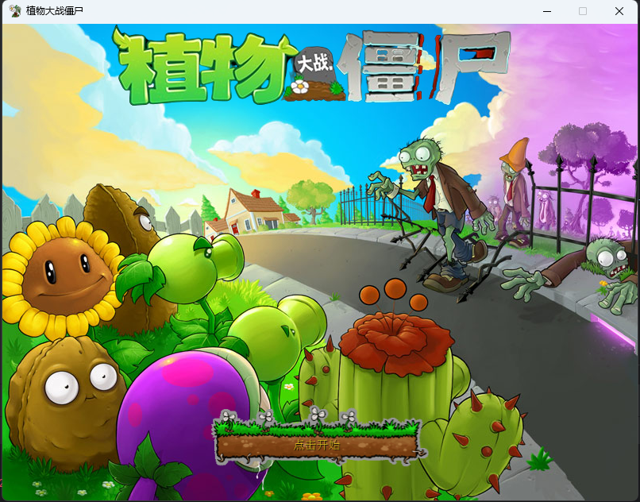
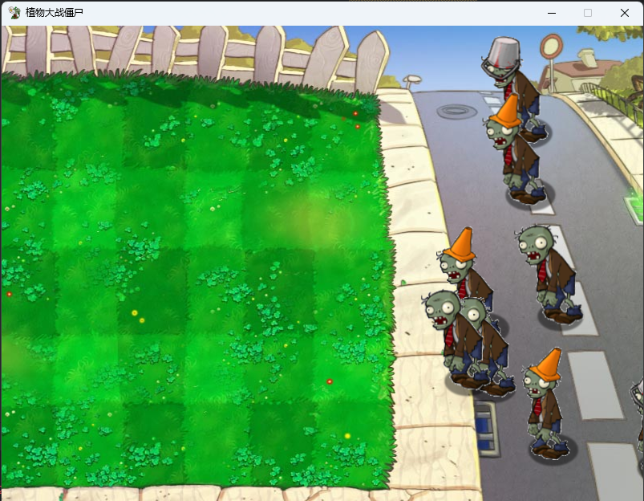
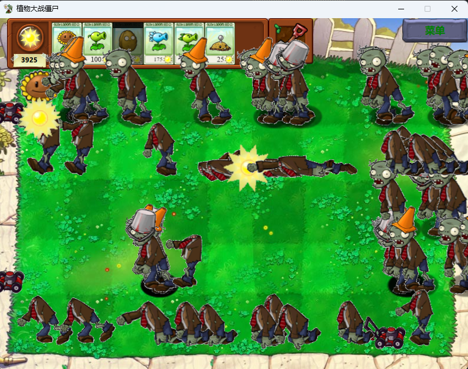

## 介绍

本项目是windows上一个基于qml的植物大战僵尸游戏

## 可暂停定时器

qml中的Timer组件是不可暂停的，本项目实现了一个可暂停的定时器

## 全局暂停

进入游戏后，当调出菜单时，游戏会暂停，菜单中有继续游戏和退出游戏两个选项

## 植物

实现了向日葵，豌豆射手，坚果墙，寒冰射手，双发射手和土豆雷，所有这些植物都继承自一个基类Plant

## 僵尸

实现了普通僵尸，路障僵尸，铁桶僵尸和旗子僵尸，所有这些僵尸都继承自一个基类Zombie

## 动画

较为完整地实现了植物和僵尸的动画，以及阳光和小推车等的动画

## 铲子

实现了铲子，可以用铲子铲除植物

## 音效

实现了背景音乐和音效

## 环境

msvc，cmake，ninja，qt

## 编译

```shell 
cmake -B build -G Ninja -DCMAKE_BUILD_TYPE=Release
cd build
ninja
```

## 运行

```shell
cd build/plantsVsZombies
./plantsVsZombies
```

## 演示











